# News-Aggregator
* A news aggregator app that offers search and archiving functionality of articles for a logged in user.
## User Story
* As a user I can search listings without logging into the site.
* As a user I can login.
* As a user I can add an article to archives while logged in.
* As a user I can use the app on any device.

## Future Functionality:
* As a user I can read the article in the app.
* As a user I can add comments to article links.
* As a user I can login using gmail.

## Wire Frames
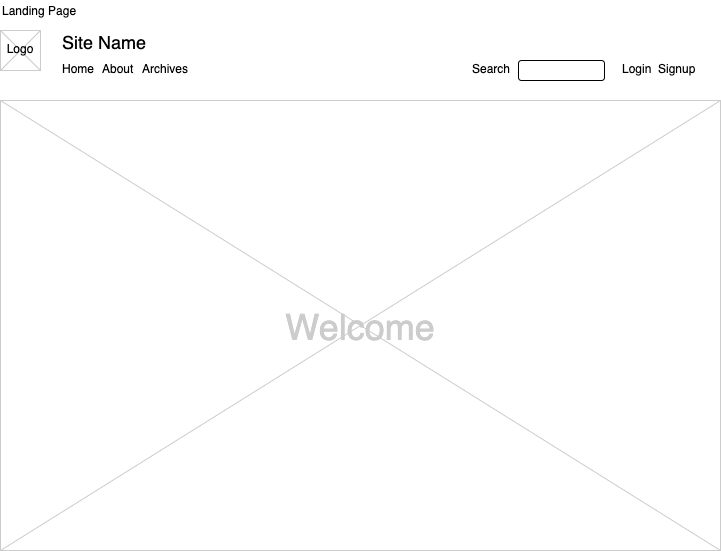
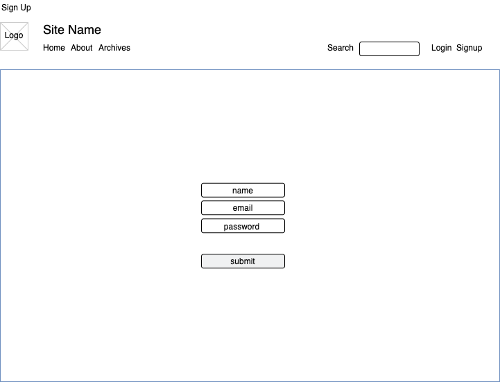
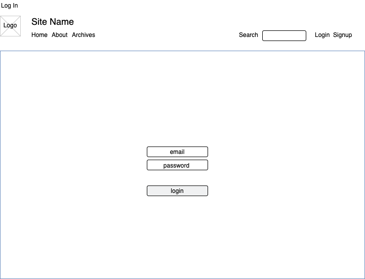
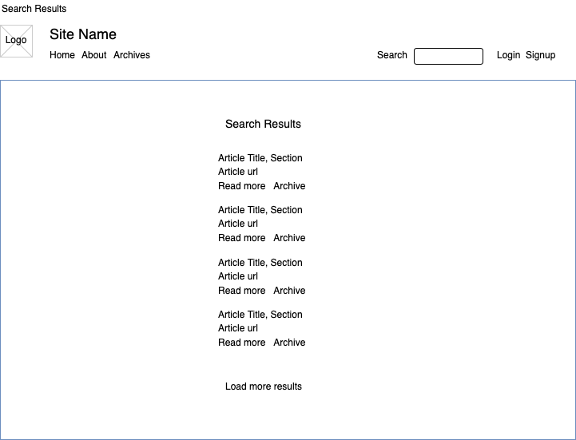
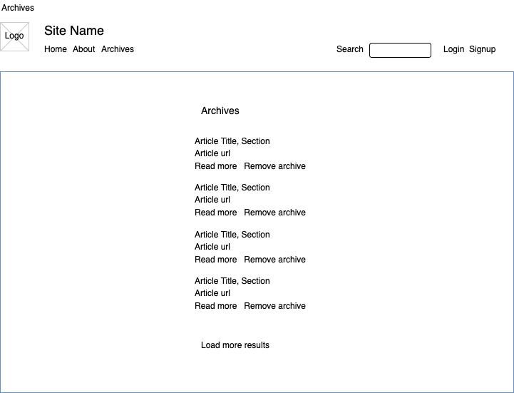
## ERD
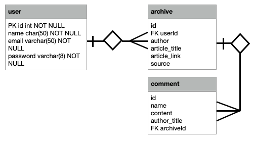
## APP
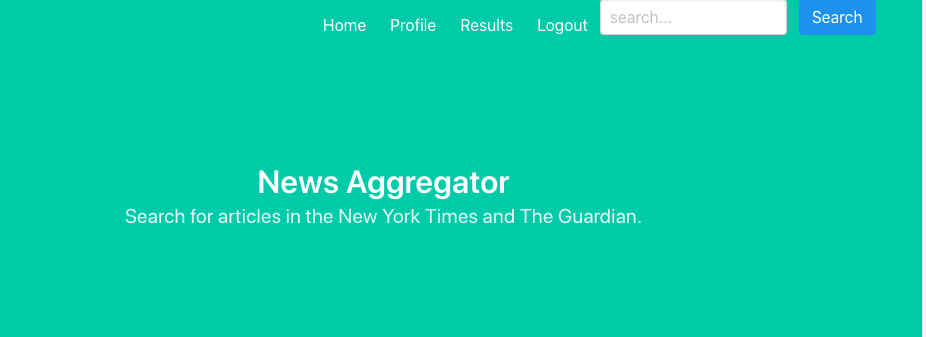
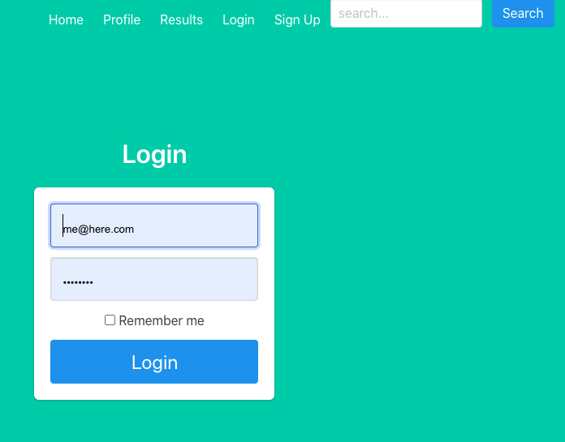
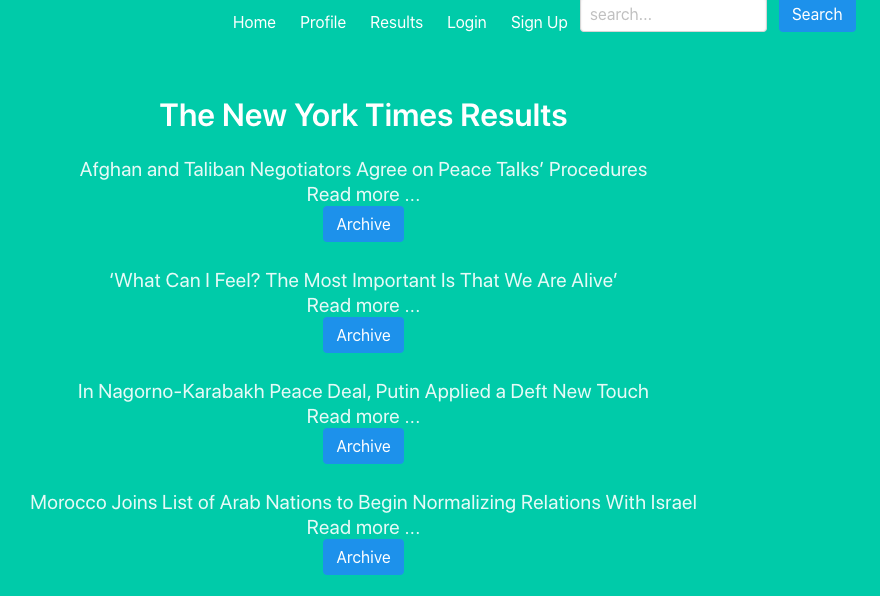

## Code Snippets
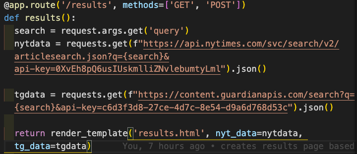
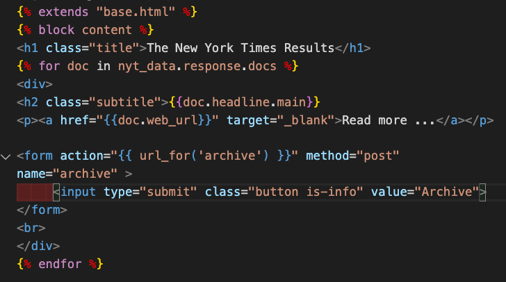

## Technology Used
* Flask
* Bulma
* Jinja2
* Python
* VS Code